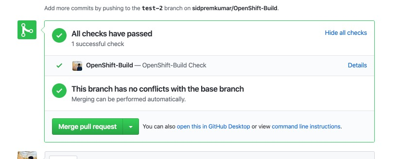
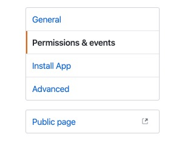
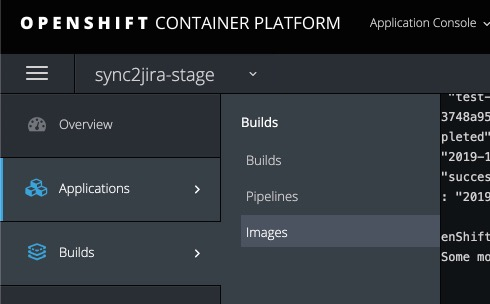
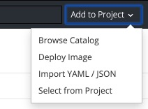
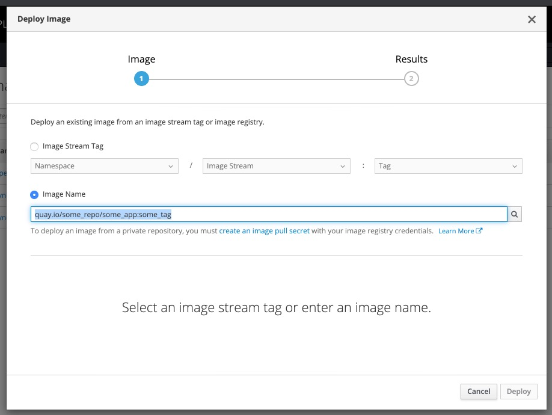

# OpenShift Build
A NodeJS application that, when deployed, will automatically check your GitHub code against tests *you* create!


## Setup

### 1 - Set up your app
There are a couple of requirements that your app needs in order to **fully** be compatible with OpenShift-Build
1. Your app needs to have a Dockerfile (this setup guide will assume that you have configured your repo on [quay.io](quat.io))
2. Currently we only support `.py` test files. But you can always call other files inside your `.py` test file. 
    1. Your Python file needs to print 2 lines to standard out as described in our [example](test_data/test.py)
3. Create a `Dockerfile.build` file and build a quay image from it
    1. You can use the example [here](Dockerfile.example)
    1. You will have to modify your Dockerfile in order to not execute your apps default script, rather to run OpenShift-Build

### 2 - Set up OpenShift-Build

1. We need to set up a WebHook at [smee.io](https://smee.io/). 
    1. We will listen to this WebHook to respond to GitHub events.
    2. Save the smee URL as you will use it later (i.e. https://smee.io/Ex...). 

2. Create your GitHub app [here](https://github.com/settings/apps).
    1. Enter the smee URL (from 1) in the WebHook field.
    2. The Homepage and redirect URL can be anything.
    3. Download a private key and convert it to a base64 single line string.
        1. You can use the following command `awk 'NF {sub(/\r/, ""); printf "%s\\n",$0;}' <your_file.pem>`
    4. Under "Permission & Events":
        1. 
        1. Allow Read & Write Access to: 
            1. Pull Requests
            1. Checks
        2. Subscribe to events:
            1. Check run
            1. Check suite
            1. Pull Request

3. Build our OpenShift Application
    1. Under images:
        1. 
        1. Add our quay image
            1. 
            2. 
    2. After we have our image and application deployment
        1. Set all environmental variables as described under [.env](openshift-build/.env) 
4. Done! 
    1. Our checks should now automatically run on all branches
    1. 


## Developing
To locally run, `cd` into our `openshift-build` folder and run:
```sh
# Install dependencies
npm install

# Run the bot
npm start
```
If all variables in `.env` are set correctly the app should start listening for checks.

## License

[ISC](LICENSE) © 2019 Sidhartha Premkumar <sid.premkumar@gmail.com>
